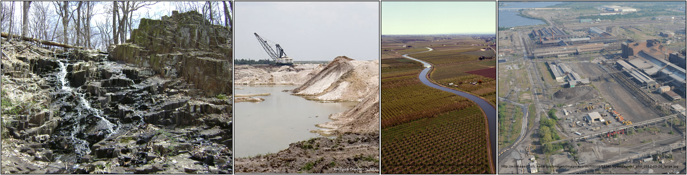

```{r,setup, include=FALSE}
knitr::opts_chunk$set(cache=TRUE)
```

## Where does phosphorus come from?
<!-- https://www.ars.usda.gov/oc/images/image-gallery/ -->

\flushleft
```{r cows, eval=TRUE, echo=FALSE, fig.height=3.0, out.height="115pt", fig.align='left'}

```

\begincols
\begincol{0.3\textwidth}
\flushright
Livestock
\endcol
\begincol{0.3\textwidth}
\flushleft
Agriculture
\endcol
\begincol{0.3\textwidth}
\center
Stormwater runoff
\endcol
\endcols

<!-- * Land-use -->
<!-- * Agriculture -->

## Where does phosphorus go?

\begincols
\begincol{0.5\textwidth}

* Plant and animal biomass

* Particle settling

* Outflow / Export

\endcol
\begincol{0.5\textwidth}

<!-- ## What is nutrient retention? -->

<!-- ### How much nutrients are present in lake outflow as a percentage of loadings? -->

\center
\vspace{-3.2em}
\lakediagramblue
\vspace{-1em}
\lakediagramgreen

\endcol
\endcols

<!-- ## Who cares about nutrient retention? -->

<!-- * Buffering Capacity -->

<!-- * Nutrient Sensitivity -->

<!-- * Water quality -->

<!-- * CNH implications -->

<!-- * Nutrient/Ag regulations -->

## What do we know about nutrient retention?

* Particle settling is important

* Greater retention is associated with longer residence times

## Previous studies on nutrient retention

\begincols
\begincol{0.5\textwidth}
```{r echo=FALSE, warning=FALSE, message=FALSE,eval=TRUE, fig.height=4.2, fig.width=4.6}
MRB1 <- read.csv("../../Dissertation/Analysis/nutrient_retention/milstead_2013.csv")
MRB1 <- MRB1[MRB1$hrt > 0,]
gg <- ggplot(MRB1, aes(x=hrt, y=1-Poutput/Pinput)) + geom_point(color = "grey") + scale_x_log10() + theme_classic() + xlab("Water Residence Time") + ylab("Rp") + theme(axis.text.x = element_text(size = 16), axis.text = element_text(size = 16), axis.title = element_text(size = 16))

x <- log(MRB1$hrt)
y <- 1-MRB1$Poutput/MRB1$Pinput
y <- y[x > -Inf]
x <- x[x > -Inf]
dat <- data.frame(cbind(x, y))

fit <- nls(y~a/(1+exp(-b * (x-c))), start = list(a=1, b=0.3, c= .1))
# library(mgcv)
# fit <- mgcv::gam(y~s(x), data = dat)

dummy_x <- seq(0.000001, 100, by = 0.1)
preds <- predict(fit, data.frame(x = dummy_x))
# preds <- preds - min(preds)
preds <- data.frame(x = log(dummy_x), preds = as.numeric(preds))
# plot(preds$x, preds$preds, ylim = c(0,1))

gg #+ geom_line(data = preds, aes(x, preds)) + coord_cartesian(xlim = c(1e-6, 10), ylim = c(0, 1))

```

\endcol

\begincol{0.5\textwidth}

```{r brett_fig, eval=TRUE, echo=FALSE, fig.height=3.0, out.height="140pt"}
knitr::include_graphics("images/brett-2008_fig6.png")
```
\endcol
\endcols

## What is the mystery about nutrient retention?

### Unresolved questions about average retention and its geographical distribution

* Difficult to measure

* Previous studies limited to small numbers of lakes (w/ long residence times?)

* Milstead et al. (2013) found much less nutrient retention than previous studies. 

## Does shorter residence time explain the discrepancy?

### What is water residence time?

How long would it take to fill up an empty lake?

Show a bar-chart of residence times with well-known lakes for comparison.

$$t_w=\frac{V_L}{Q}$$

```{r echo=FALSE, cache=TRUE, message=FALSE, warning=FALSE, fig.height=2.5, fig.width=5, out.width="200pt"}
library(ggplot2)
ggplot(MRB1, aes(x = hrt)) + geom_histogram() + scale_x_log10() + theme_classic() + ylab("Count") + xlab("Water Residence Time (y)") + coord_cartesian(xlim=c(1e-06,1)) + theme(axis.text.x = element_text(size = 16), axis.text = element_text(size = 16), axis.title = element_text(size = 16))

# hivolumerating <- as.numeric(MRB1$Volume > median(MRB1$Volume))
# hiflowrating   <- as.numeric(MRB1$FlowM3_yr > median(MRB1$FlowM3_yr))
# hiflowrating[hiflowrating == 0] <- 2
# hiflowrating[hiflowrating == 1] <- 4
# 
# rating <- hiflowrating + hivolumerating
# rating[rating == 3] <- "low"
# rating[rating == 4] <- "high"
# rating[rating == 2 | rating == 5] <- "medium"
# rating <- factor(rating, levels = c("low", "medium", "high"))
# 
# res <- matrix(table(rating) / nrow(MRB1), nrow = 2)
# row.names(res) <- c("low volume", "high volume")
# res <- data.frame(res)
# names(res) <- c("low flow", "high flow")

# plot(MRB1$Volume/MRB1$FlowM3_yr, MRB1$hrt, xlim = c(0, 100), ylim = c(0, 100))
```

## Is connectivity predictive of nutrient retention?

### What are lake connectivity classes?
<!-- http://cremeronline.com/LaTeX/minimaltikz.pdf -->
<!-- \draw [help lines] (0,3) grid (4,-3); -->

\connectivitydiagram

## Show some connectivity data

\begincols
\begincol{0.4\textwidth}
\center
```{r echo=FALSE, fig.height=4.5, fig.width=5, out.width="180pt", warning=FALSE, message=FALSE, results='hide'}
library(LAGOS)
library(ggplot2)
library(cowplot)

dt <- lagos_load("1.087.0")$lake.specific
dt$laws <- dt$lake_area_ha/dt$iws_areaha
levels(dt$lakeconnectivity) <- c("Secondary", "Primary", "Headwater", "Isolated")

# gg <- ggplot(data = dt) + geom_bar(data = dt, aes(x = lakeconnectivity)) + theme_cowplot() + theme(axis.text.x = element_text(angle = 90, hjust = 1)) + xlab("") + ylab("Count")
# gg

ggplot(data = dt) + geom_boxplot(data = dt, aes(x = lakeconnectivity, y = laws), outlier.shape = NA) + theme_cowplot() + theme(axis.text.x = element_text(angle = 90, hjust = 1)) + coord_cartesian(ylim = c(0,1)) + xlab("") + ylab("Lake Area / Watershed Area")
```
\endcol
\begincol{0.6\textwidth}
```{r echo=FALSE, fig.height=4.5, fig.width=5, out.width="200pt", warning=FALSE}
suppressPackageStartupMessages(library(mapdata))

dt_mi <- dt[dt$state_name == "Michigan",]
# dt_mi <- dt_mi[sample(1:nrow(dt_mi), 100),]

na_map <- map_data("world2Hires", c("Canada", "USA"))
mi_map <- map_data("state", "Michigan")

# ggplot()+ geom_polygon(data = mi_map, aes(x = long, y = lat, group = group)) + coord_fixed(1.3) + guides(fill = FALSE)

blank_opts <- theme(legend.position = "top", axis.text = element_blank(), axis.line = element_blank(), axis.title = element_blank(), axis.ticks = element_blank())
coord_opts <- theme(legend.position = "bottom")

# ggplot() + geom_polygon(data = na_map, aes(x = long, y = lat, group = group)) + coord_fixed(1.3, xlim = c(263, 295), ylim = c(34, 49)) + geom_point(size = 0.2, data = dt, aes(x = nhd_long + 360, y = nhd_lat, color = lakeconnectivity)) + guides(fill = FALSE) + guides(colour = guide_legend(override.aes = list(size=10), title = NULL)) + viridis::scale_color_viridis(discrete = TRUE, direction = -1) + map_opts

ggplot() + geom_polygon(data = mi_map, aes(x = long, y = lat, group = group), color = "black", fill = "white") + coord_fixed(1.3) + geom_point(size = 0.02, data = dt_mi, aes(x = nhd_long, y = nhd_lat, color = lakeconnectivity)) + guides(fill = FALSE) + guides(colour = guide_legend(override.aes = list(size=8), title = NULL, nrow = 2, byrow = TRUE)) + viridis::scale_color_viridis(discrete = TRUE, direction = -1) + blank_opts

```

\endcol
\endcols

## What are my predictions?

\center
```{r predictions, eval=TRUE, echo=FALSE, fig.height=3.0, out.height="180pt"}
knitr::include_graphics("images/conceptual.png")
```


## What are my predictions?

\center
\begin{tabularx}{\textwidth}{ l c| K{1.5cm} | C {1.5cm} | C{1.5cm} |}
\multicolumn{2}{c}{}
& \multicolumn{3}{c}{Connectivity} \\
\multicolumn{2}{c}{}
 &  \multicolumn{1}{c}{High}
 &  \multicolumn{1}{c}{Medium}
 & \multicolumn{1}{c}{Low} \\
\cline{3-5}
& \rotatebox[origin=c]{90}{Low} & \cellcolor{black!25}Medium & \cellcolor{black!10}Low & Low\\
\cline{3-5}
\raisebox{-.5\normalbaselineskip}[0pt][0pt]{\rotatebox[origin=c]{90}{Water Residence Time}} & \rotatebox[origin=c]{90}{Medium} & \cellcolor{black!45}High & \cellcolor{black!25}Medium & \cellcolor{black!10}Low\\
\cline{3-5}
& \rotatebox[origin=c]{90}{High} & \cellcolor{black!55}High & \cellcolor{black!45}High & \cellcolor{black!25}Medium\\
\cline{3-5}
\end{tabularx}


## How I will test my predictions

1. Calculate water residence time in 50,000 lakes

2. Calculate nutrient retention

3. Relate retention, residence time, and connectivity

## What are the implications of this work?

\center
```{r lagos, eval=TRUE, echo=FALSE, fig.height=3.0, out.height="180pt"}
knitr::include_graphics("images/lagos_study-extent.png.png")
```


<!-- http://www.jpl.nasa.gov/spaceimages/images/largesize/PIA03434_hires.jpg -->

<!-- ## Using Blocks -->

<!-- Consider the example of three different block environments -->
<!-- are pre-defined and may be styled with an optional background color. -->

<!-- <!-- this sets the background -->
<!-- \metroset{block=fill}  -->

<!-- \begin{block}{Default} -->
<!--   Block content. -->
<!-- \end{block} -->

<!-- \begin{alertblock}{Alert} -->
<!--   Block content. -->
<!-- \end{alertblock} -->

<!-- \begin{exampleblock}{Example} -->
<!--   Block content. -->
<!-- \end{exampleblock} -->

<!-- ## What is SPARROW? -->

<!-- \pagecolor{white} -->

<!-- \center -->
<!-- ```{r sparrow, eval=TRUE, echo=FALSE, fig.height=3.0, out.height="180pt"} -->
<!-- knitr::include_graphics("images/sparrow.png") -->
<!-- ``` -->

<!-- * A spatial not temporal model (operates on mean annual values) -->

<!-- $$wq \sim land use + soils + precipitation + water velocity$$ -->

<!-- * base year is 2002 -->

<!-- ## What is LAGOS? -->

<!-- \center -->
<!-- ```{r lagos_fig, eval=TRUE, echo=FALSE, fig.height=3.0, out.height="180pt"} -->
<!-- knitr::include_graphics("images/lagos_study-extent.png") -->
<!-- ``` -->

<!-- * Approximately 50,000 lakes -->

