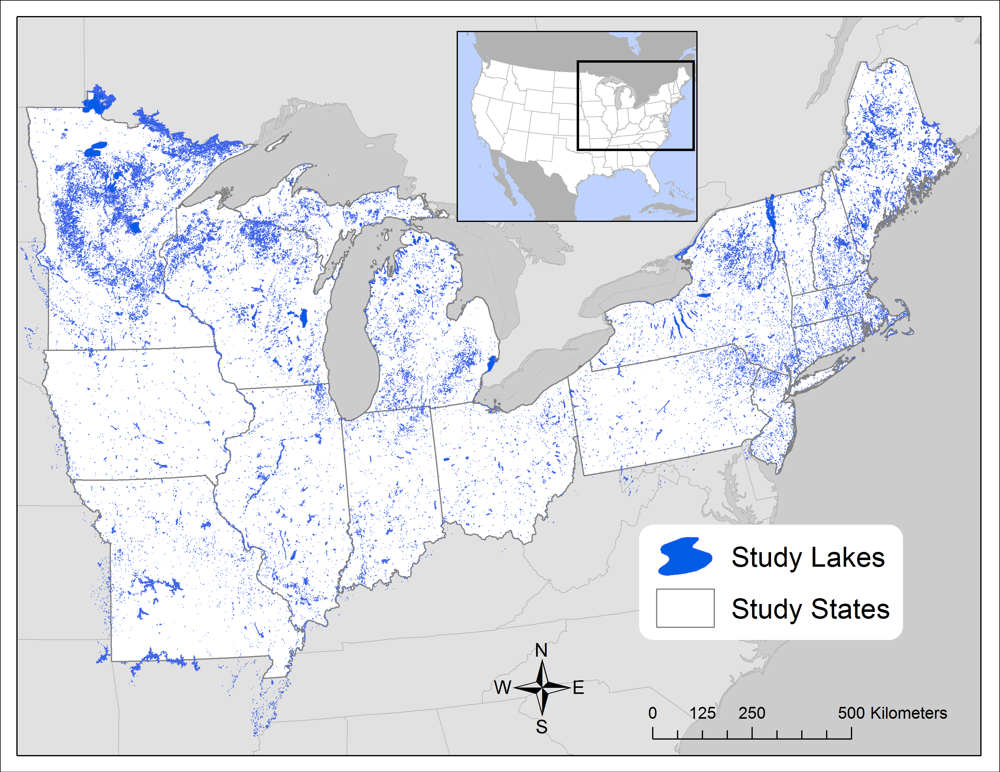

```{r,setup, include=FALSE}
knitr::opts_chunk$set(cache=TRUE)
```

## Where does phosphorus come from?

<!-- We can predict phosphorus loading from land use. -->

\flushleft
\includegraphics[height=120pt]{images/nutrientmontage.png}

\begincols
\begincol{0.3\textwidth}
\flushleft
Natural Sources
\endcol
\begincol{0.2\textwidth}
\flushleft
Mining
\endcol
\begincol{0.2\textwidth}
\flushleft
Agriculture
\endcol
\begincol{0.3\textwidth}
\center
Stormwater runoff
\endcol
\endcols

## Where does phosphorus go? 
<!-- The difference between inputs and outputs is called retention. -->

<!-- We know a lot about the mechanisms of phosphorus processing. For example, we know that phosphorus can end up either being taken up, settled, or exported. We know that all of these processes are dependent to some degree on residence time. Greater retention is associated with longer residence times but we don't know average retention, or its spatial distribution.
-->

\begincols
\begincol{0.5\textwidth}

* Plant and animal biomass

\vspace{1em}

* Particle settling

\vspace{1em}

* Outflow / Export

\endcol
\begincol{0.5\textwidth}
\pause
\center
\vspace{-3.2em}
\lakediagramblue
\vspace{-1em}
\lakediagramgreen

\endcol
\endcols

## Why do we care?

<!-- Nutrient retention is important because it says something about potential sensitivity to loading. Should we spend money to reduce loading? -->

## What is water residence time?

### How long would it take to fill up an empty lake?

\begincols
\begincol{0.4\textwidth}
$$t_w=\frac{V_L}{Q}$$
\pause
$$y = \frac{m^3}{1}*\frac{y}{m^3}$$
\pause
\endcol
\begincol{0.6\textwidth}
\center
```{r echo=FALSE, message=FALSE, fig.height=6, out.height="180pt", fig.width=6}
library(ggplot2)
MRB1 <- read.csv("../../Dissertation/Analysis/nutrient_retention/milstead_2013.csv", stringsAsFactors = FALSE)
MRB1 <- MRB1[!is.na(MRB1$NLA_ID),]

library(nlaR)
nla <- nlaR::nla_load(2007)
# nla$SampledLakeInformation[nla$SampledLakeInformation$LAKENAME == "Haynes Reservoir",]
nla <- nla$SampledLakeInformation[,c("SITE_ID", "LAKENAME")]

dt <- merge(MRB1, nla, by.x = "NLA_ID", by.y = "SITE_ID", all.x = TRUE, all.y = FALSE)
dt <- dt[!duplicated(dt$LAKENAME),]
dt <- with(dt, dt[order(hrt),])
dt <- within(dt, {
  LAKENAME <- reorder(LAKENAME, seq_along(LAKENAME), order = TRUE)
})
# dt[dt$LAKENAME == "Spring Lake",]
dt <- dt[,c("hrt", "LAKENAME")]

superior <- data.frame(hrt = as.numeric(strsplit(wikilake::lake_wiki("Lake Superior")[,c("Residence time")], " ")[[1]][1]), LAKENAME = "Lake Superior")

library(scales)
mylog_trans <- function(base=exp(1), from=0) 
{
  trans <- function(x) log(x, base)-from
  inv <- function(x) base^(x+from)
  trans_new("mylog", trans, inv, log_breaks(base=base), 
            domain = c(base^from, 1000))
}
options(scipen = 999)
set.seed(4)
ggplot(data = rbind(dt[sample(1:nrow(dt), 12),], superior)) + geom_bar(aes(y = hrt, x = LAKENAME), stat = "identity") + theme_classic() + scale_y_continuous(trans = mylog_trans(base = 10, from = -4), limits = c(0.0001, 1000)) + theme(axis.text.x = element_text(angle = 90, size = 16), axis.title.x = element_blank(), axis.text = element_text(size = 16), axis.title = element_text(size = 16)) + ylab("Residence Time (years)")
options(scipen = 0)

```
\endcol
\endcols


## How does residence time relate to nutrient retention?

<!-- * How does retention vary across the full spectrum of water residence times? -->
<!-- What are the factors that cause a lake of the same residence time to have a different retention? -->

\begincols
\begincol{0.5\textwidth}
\flushright
\footnotesize
Brett and Benjamin (2008)
\endcol
\begincol{0.5\textwidth}
\flushright
\footnotesize
Milstead et al. (2013)
\endcol
\endcols

\center
```{r echo=FALSE, message=FALSE, warning=FALSE, fig.height=4.5, fig.width=8.7}
milstead <- read.csv("../../Dissertation/Analysis/nutrient_retention/milstead_2013.csv")
milstead$Rp <- 1-(milstead$Poutput/milstead$Pinput)
milstead$flushing.rate <- 1/milstead$hrt
milstead$source <- "milstead"

brett <- read.csv("/home/jose/Documents/Science/JournalSubmissions/gReen2O/Vollenweider_lakes_raw.csv", stringsAsFactors = FALSE)
brett_data <- read.csv("/home/jose/Documents/Science/JournalSubmissions/gReen2O/Vollenweider_lakes_raw.csv", stringsAsFactors = FALSE, skip = 4, header = FALSE)
names(brett_data) <- names(brett)
brett_data <- brett_data[!is.na(brett_data$X),]
brett_data$Rp <- as.numeric(brett_data$Rp)
brett_data$flushing.rate <- as.numeric(brett_data$flushing.rate)
brett_data <- brett_data[,c("flushing.rate", "Rp")]
brett_data$source <- "brett"

dt <- rbind(milstead[,c("flushing.rate", "Rp", "source")], brett_data)
dt <- dt[1/dt$flushing.rate < 1000 & 1/dt$flushing.rate > 0.000001,]

# loess
# ggplot(data = na.omit(dt[dt$Rp > 0,]), aes(x = 1/flushing.rate, y = Rp)) + geom_point() + scale_x_log10() + viridis::scale_color_viridis(discrete = TRUE, direction = -1) + xlab("Water Residence Time") + stat_smooth(method = "loess", se = FALSE) + facet_grid(. ~ source)

# glm
ggplot(data = na.omit(dt[dt$Rp > 0,]), aes(x = 1/flushing.rate, y = Rp)) +
  geom_point() + scale_x_log10(labels = c("1e-07", "1e-04", "0.1", "100")) +
  viridis::scale_color_viridis(discrete = TRUE, direction = -1) +
  xlab("Water Residence Time (years)") +
  stat_smooth(method = "glm", method.args = list(family = "binomial"), se = FALSE) +
  facet_grid(. ~ source) +
  theme(strip.background = element_blank(), strip.text = element_blank())

# gam
# ggplot(data = na.omit(dt[dt$Rp > 0,]), aes(x = 1/flushing.rate, y = Rp)) + geom_point() + scale_x_log10() + viridis::scale_color_viridis(discrete = TRUE, direction = -1) + xlab("Water Residence Time") + stat_smooth(method = "gam", formula = y~s(x, k = 6), se = FALSE) + facet_grid(. ~ source, scales = "free_x")

# no facet

# ggplot(data = na.omit(dt), aes(x = 1/flushing.rate, y = Rp, color = source)) + geom_point() + ylim(0, 1) + scale_x_log10() + viridis::scale_color_viridis(discrete = TRUE, direction = -1) + xlab("Water Residence Time") + stat_smooth(method = "glm", method.args = list(family = "binomial"), se = FALSE)

# + stat_smooth(se = FALSE, formula = y~s(x, k = 10), method = "gam")
# + theme(legend.position = "none")


```

<!-- ```{r echo=FALSE, cache=TRUE, message=FALSE, warning=FALSE, fig.height=2.5, fig.width=5, out.width="200pt"} -->
<!-- library(ggplot2) -->
<!-- MRB1 <- read.csv("../../Dissertation/Analysis/nutrient_retention/milstead_2013.csv") -->
<!-- ggplot(MRB1, aes(x = hrt)) + geom_histogram() + scale_x_log10() + theme_classic() + ylab("Count") + xlab("Water Residence Time (y)") + coord_cartesian(xlim=c(1e-06,1)) + theme(axis.text.x = element_text(size = 16), axis.text = element_text(size = 16), axis.title = element_text(size = 16)) -->

<!-- # hivolumerating <- as.numeric(MRB1$Volume > median(MRB1$Volume)) -->
<!-- # hiflowrating   <- as.numeric(MRB1$FlowM3_yr > median(MRB1$FlowM3_yr)) -->
<!-- # hiflowrating[hiflowrating == 0] <- 2 -->
<!-- # hiflowrating[hiflowrating == 1] <- 4 -->
<!-- #  -->
<!-- # rating <- hiflowrating + hivolumerating -->
<!-- # rating[rating == 3] <- "low" -->
<!-- # rating[rating == 4] <- "high" -->
<!-- # rating[rating == 2 | rating == 5] <- "medium" -->
<!-- # rating <- factor(rating, levels = c("low", "medium", "high")) -->
<!-- #  -->
<!-- # res <- matrix(table(rating) / nrow(MRB1), nrow = 2) -->
<!-- # row.names(res) <- c("low volume", "high volume") -->
<!-- # res <- data.frame(res) -->
<!-- # names(res) <- c("low flow", "high flow") -->

<!-- # plot(MRB1$Volume/MRB1$FlowM3_yr, MRB1$hrt, xlim = c(0, 100), ylim = c(0, 100)) -->
<!-- ``` -->

<!-- ## What is lake connectivity? -->

<!-- <!-- Variation within these classes like the number of tributary streams and upstream lakes. --> -->

<!-- <!-- \draw [help lines] (0,3) grid (4,-3); --> -->
<!-- \connectivitydiagram -->


## What is lake connectivity?

\begincols

\begincol{0.33\textwidth}
\vspace{-2em}
\secondaryprofile
\endcol

\begincol{0.33\textwidth}
\vspace{4em}
\primaryprofile
\endcol

\begincol{0.33\textwidth}
\vspace{-10em}
\headwaterprofile
\endcol

\begincol{0.33\textwidth}
\vspace{-12em}
\isolatedprofile
\endcol

\endcols

## Connectivity versus residence time

\begincols
\begincol{0.25\textwidth}
\center
```{r echo=FALSE, fig.height=4, fig.width=3, out.width="110pt", out.height="150pt", warning=FALSE, message=FALSE, results='hide'}
library(LAGOS)
library(ggplot2)
library(cowplot)

dt <- lagos_load("1.087.0")$lake.specific
dt$laws <- dt$lake_area_ha/dt$iws_areaha
levels(dt$lakeconnectivity) <- c("Secondary", "Primary", "Headwater", "Isolated")
median(dt$laws[dt$lakeconnectivity == "DR_LakeStream"], na.rm = TRUE)
median(dt$laws[dt$lakeconnectivity == "DR_Stream"], na.rm = TRUE)

# gg <- ggplot(data = dt) + geom_bar(data = dt, aes(x = lakeconnectivity)) + theme_cowplot() + theme(axis.text.x = element_text(angle = 90, hjust = 1)) + xlab("") + ylab("Count")
# gg

ggplot(data = dt) + geom_boxplot(data = dt, aes(x = lakeconnectivity, y = laws), outlier.shape = NA) + theme_cowplot() + theme(axis.text.x = element_text(angle = 90, hjust = 1)) + coord_cartesian(ylim = c(0,1)) + xlab("") + ylab("Residence Time (WSLA Ratio)")
# + scale_x_discrete(limits = c("Primary", "Secondary", "Headwater", "Isolated"))
```
\endcol
\begincol{0.75\textwidth}
\center
```{r echo=FALSE, fig.height=5.5, fig.width=6, out.width="380pt", warning=FALSE}
suppressPackageStartupMessages(library(mapdata))

dt_mi <- dt[dt$state_name == "Michigan",]
# dt_mi <- dt_mi[sample(1:nrow(dt_mi), 100),]

na_map <- map_data("world2Hires", c("Canada", "USA"))
mi_map <- map_data("state", "Michigan")
mi_map <- mi_map[mi_map$subregion == "south",]

dt_mi <- dt_mi[dt_mi$nhd_long < max(mi_map$long) &
                 dt_mi$nhd_long > min(mi_map$long) &
                 dt_mi$nhd_lat < max(mi_map$lat) &
                 dt_mi$nhd_lat > min(mi_map$lat),]
           
# ggplot()+ geom_polygon(data = mi_map, aes(x = long, y = lat, group = group)) + coord_fixed(1.3) + guides(fill = FALSE)

blank_opts <- theme(legend.position = c(0.93, 0.73), axis.text = element_blank(), axis.line = element_blank(), axis.title = element_blank(), axis.ticks = element_blank())
coord_opts <- theme(legend.position = "bottom")

# ggplot() + geom_polygon(data = na_map, aes(x = long, y = lat, group = group)) + coord_fixed(1.3, xlim = c(263, 295), ylim = c(34, 49)) + geom_point(size = 0.2, data = dt, aes(x = nhd_long + 360, y = nhd_lat, color = lakeconnectivity)) + guides(fill = FALSE) + guides(colour = guide_legend(override.aes = list(size=10), title = NULL)) + viridis::scale_color_viridis(discrete = TRUE, direction = -1) + map_opts

ggplot() + geom_polygon(data = mi_map, aes(x = long, y = lat, group = group), color = "black", fill = "white") + coord_fixed(1.3) + geom_point(size = 0.8, data = dt_mi[sample(1:nrow(dt_mi), 760),], aes(x = nhd_long, y = nhd_lat, color = lakeconnectivity)) + guides(fill = FALSE) + guides(colour = guide_legend(override.aes = list(size=6), title = NULL)) + blank_opts + scale_color_brewer(palette = "Set1")
# viridis::scale_color_viridis(option = "plasma", discrete = TRUE, direction = -1) + blank_opts

```

\endcol
\endcols

## What are my predictions?
\center
\includegraphics[width=7.5cm]{images/conceptual.png}

## Nutrient retention predictions
<!-- \begincols -->
<!-- \begincol{0.33\textwidth} -->
<!-- Loading -->
<!-- \endcol -->
<!-- \begincol{0.33\textwidth} -->
\center
\secondaryprofileplus
\primaryprofileplus
<!-- \endcol -->
<!-- \begincol{0.33\textwidth} -->
<!-- \flushright -->
<!-- Losses -->
<!-- \endcol -->
<!-- \endcols -->

<!-- ## Nutrient retention predictions -->

<!-- \hspace{3cm} -->
<!-- \begin{tabularx}{\textwidth}{ l c| K{1.5cm} | C {1.5cm} | C{1.5cm} |} -->
<!-- \multicolumn{2}{c}{} -->
<!-- & \multicolumn{3}{c}{Connectivity} \\ -->
<!-- \multicolumn{2}{c}{} -->
<!--  &  \multicolumn{1}{c}{ -->
<!--  \begin{tikzpicture}[scale=0.2] -->
<!--       \draw [-,ultra thick, cyan] (-1,3) to [out=270,in=180] (0.2,2) to [out=0,in=90] (0,0.3) to [out=90,in=0] (0,-1) to [out=90,in=0] (0.2,-2) to [out=180,in=90] (-1,-3); -->
<!--       \draw[cyan, ultra thick, domain=0:350, smooth cycle, fill=cyan,yshift=20] plot (\x:0.5+rnd*0.25); -->
<!--       \draw[cyan, ultra thick, domain=0:350, smooth cycle, fill=cyan,yshift=-50] plot (\x:0.8+rnd*0.5); -->
<!--     \end{tikzpicture}} -->
<!--  &  \multicolumn{1}{c}{ -->
<!--  \begin{tikzpicture}[scale=0.2] -->
<!--       \draw [-,ultra thick, cyan] (-1,3) to [out=270,in=180] (0.2,2) to [out=0,in=90] (0,0); -->
<!--       \draw[cyan, ultra thick, domain=0:350, smooth cycle, fill=cyan] (0,-3) plot (\x:1+rnd*0.5); -->
<!--   \end{tikzpicture}} -->
<!--  & \multicolumn{1}{c}{ -->
<!--  \begin{tikzpicture}[scale=0.4] -->
<!--       \draw[cyan, ultra thick, domain=0:350, smooth cycle, fill=cyan] plot (\x:1+rnd*0.5); -->
<!--   \end{tikzpicture}} \\ -->
<!-- \cline{3-5} -->
<!-- & \rotatebox[origin=c]{90}{Low} & Low & \cellcolor{darkgreen!30}Low & \cellcolor{darkgreen!75}Medium\\ -->
<!-- \cline{3-5} -->
<!-- \raisebox{-.5\normalbaselineskip}[0pt][0pt]{\rotatebox[origin=c]{90}{Water Residence Time}} & \rotatebox[origin=c]{90}{Medium} & \cellcolor{darkgreen!30}Low & \cellcolor{darkgreen!75}Medium & \cellcolor{darkgreen}High\\ -->
<!-- \cline{3-5} -->
<!-- & \rotatebox[origin=c]{90}{High} & \cellcolor{darkgreen!75}Medium & \cellcolor{darkgreen}High & \cellcolor{darkgreen}High\\ -->
<!-- \cline{3-5} -->
<!-- \end{tabularx} -->

## How I will test my predictions

### Calculate water residence time in 50,000 lakes
\pause
\center
```{r lagos, eval=TRUE, echo=FALSE, fig.height=3.0, out.height="180pt"}

```

## How I will test my predictions
### Calculate water residence time in 50,000 lakes
\vspace{3em}
### Calculate nutrient retention
\vspace{3em}

## How I will test my predictions
### Calculate water residence time in 50,000 lakes
\vspace{3em}
### Calculate nutrient retention
\vspace{3em}
### Relate retention, residence time, and connectivity
\vspace{3em}


<!-- http://www.jpl.nasa.gov/spaceimages/images/largesize/PIA03434_hires.jpg -->

<!-- ## Using Blocks -->

<!-- Consider the example of three different block environments -->
<!-- are pre-defined and may be styled with an optional background color. -->

<!-- <!-- this sets the background -->
<!-- \metroset{block=fill}  -->

<!-- \begin{block}{Default} -->
<!--   Block content. -->
<!-- \end{block} -->

<!-- \begin{alertblock}{Alert} -->
<!--   Block content. -->
<!-- \end{alertblock} -->

<!-- \begin{exampleblock}{Example} -->
<!--   Block content. -->
<!-- \end{exampleblock} -->

<!-- ## What is SPARROW? -->

<!-- \pagecolor{white} -->

<!-- \center -->
<!-- knitr::include_graphics("images/sparrow.png") -->
<!-- ``` -->

<!-- * A spatial not temporal model (operates on mean annual values) -->

<!-- $$wq \sim land use + soils + precipitation + water velocity$$ -->

<!-- * base year is 2002 -->

<!-- ## What is LAGOS? -->

<!-- \center -->
<!-- ```{r lagos_fig, eval=TRUE, echo=FALSE, fig.height=3.0, out.height="180pt"} -->
<!--  -->
<!-- ``` -->

<!-- * Approximately 50,000 lakes -->

<!-- ## Previous studies on nutrient retention -->

<!-- \begincols -->
<!-- \begincol{0.5\textwidth} -->
<!-- ```{r echo=FALSE, warning=FALSE, message=FALSE,eval=TRUE, fig.height=4.2, fig.width=4.6} -->
<!-- MRB1 <- read.csv("../../Dissertation/Analysis/nutrient_retention/milstead_2013.csv") -->
<!-- MRB1 <- MRB1[MRB1$hrt > 0,] -->
<!-- gg <- ggplot(MRB1, aes(x=hrt, y=1-(Poutput/Pinput))) + geom_point(color = "grey") + scale_x_log10(labels = c("1e-11", "1e-07", "1e-04", "0.1", "100")) + theme_classic() + xlab("Water Residence Time") + ylab("Rp") + theme(axis.text.x = element_text(size = 16), axis.text = element_text(size = 16), axis.title = element_text(size = 16)) -->

<!-- x <- log(MRB1$hrt) -->
<!-- y <- 1-MRB1$Poutput/MRB1$Pinput -->
<!-- y <- y[x > -Inf] -->
<!-- x <- x[x > -Inf] -->
<!-- dat <- data.frame(cbind(x, y)) -->

<!-- fit <- nls(y~a/(1+exp(-b * (x-c))), start = list(a=1, b=0.3, c= .1)) -->
<!-- # library(mgcv) -->
<!-- # fit <- mgcv::gam(y~s(x), data = dat) -->

<!-- dummy_x <- seq(0.000001, 100, by = 0.1) -->
<!-- preds <- predict(fit, data.frame(x = dummy_x)) -->
<!-- # preds <- preds - min(preds) -->
<!-- preds <- data.frame(x = log(dummy_x), preds = as.numeric(preds)) -->
<!-- # plot(preds$x, preds$preds, ylim = c(0,1)) -->

<!-- gg #+ geom_line(data = preds, aes(x, preds)) + coord_cartesian(xlim = c(1e-6, 10), ylim = c(0, 1)) -->

<!-- ``` -->

<!-- \endcol -->

<!-- \begincol{0.5\textwidth} -->

<!-- ```{r brett_fig, eval=TRUE, echo=FALSE, fig.height=3.0, out.height="140pt"} -->
<!-- knitr::include_graphics("images/brett-2008_fig6.png") -->
<!-- ``` -->
<!-- \endcol -->
<!-- \endcols -->